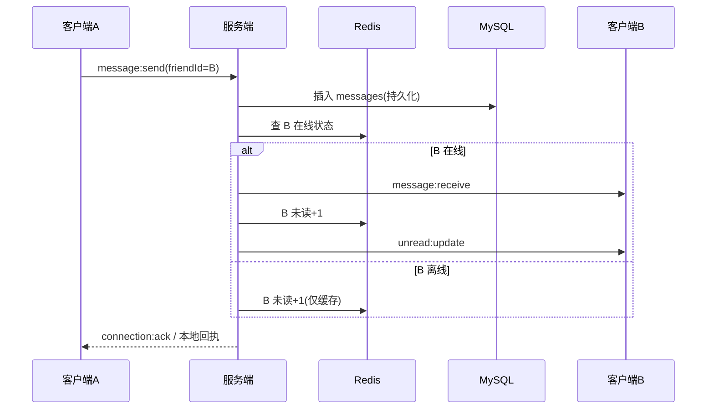

# 实时聊天 Web 应用 — 系统设计（数据库 / 接口 / 业务流程）

> 依据：飞书云文档《实时聊天 Web 应用需求文档》（token `QEO2doxvZoYCbWxlZrCcvjYlnLH`，rev 6）
> 阶段：系统设计（不含代码）
> 配套交付：本文件 → 飞书云文档 + 本地 Word；页面原型见独立飞书画板

---

## 0. 设计假设与待确认项

需求文档中有 6 项未决，系统设计按**推荐默认值**推进，后续可调整。

| 编号 | 待确认项 | 本次采用默认值 | 理由 |
|------|----------|----------------|------|
| B1 | 后端技术栈 | **NestJS + Socket.IO** | 与 React/TS 前端同语言，迭代最快；WebSocket 生态成熟 |
| B2 | 图片存储 | **对象存储抽象层**（先本地磁盘实现，接口预留 OSS/MinIO） | 本地磁盘 MVP 可用，抽象后无缝迁移云存储 |
| M1 | 部署形态 | **单节点起步，消息分发器抽象为发布/订阅接口**（预留 Redis Pub/Sub） | 非功能写"单节点 5000+ 并发"；抽象后横向扩展零改造 |
| M4 | Token 机制 | **access(15min) + refresh(7d) 双 token，Redis 维护吊销黑名单** | 支持连接内过期处理与"改密/封禁即踢线" |
| 范围 | 群聊/撤回/编辑 | **本期仅单聊，不含群聊、消息撤回与编辑** | 需求未要求，显式裁剪避免歧义 |
| 部署 | 运行形态 | **Docker 化 + Nginx 反代（WSS/HTTPS）** | 生产必要条件，详见第 4 节 |

> 其余评审发现的缺口（头像接口 M3、Redis 持久化降级 M2、好友并发 M5 等）已在下文中落地。

---

## 1. 数据库设计

### 1.1 MySQL 表结构

```sql
-- 用户信息表
CREATE TABLE users (
  id            BIGINT UNSIGNED NOT NULL AUTO_INCREMENT,
  username      VARCHAR(64)  NOT NULL COMMENT '登录名，唯一',
  password_hash VARCHAR(255) NOT NULL COMMENT 'bcrypt 加盐哈希',
  nickname      VARCHAR(64)  NOT NULL,
  avatar_url    VARCHAR(512) DEFAULT NULL COMMENT '头像，注册后可更新(M3)',
  status        TINYINT      NOT NULL DEFAULT 1 COMMENT '1正常 2禁用',
  last_seen_at  DATETIME     DEFAULT NULL COMMENT '最后在线时间',
  created_at    DATETIME     NOT NULL DEFAULT CURRENT_TIMESTAMP,
  updated_at    DATETIME     NOT NULL DEFAULT CURRENT_TIMESTAMP ON UPDATE CURRENT_TIMESTAMP,
  PRIMARY KEY (id),
  UNIQUE KEY uk_username (username)
) ENGINE=InnoDB DEFAULT CHARSET=utf8mb4;

-- 好友关系表（双向，各存一行或用 (user_id,friend_id) 唯一）
CREATE TABLE friendships (
  id         BIGINT UNSIGNED NOT NULL AUTO_INCREMENT,
  user_id    BIGINT UNSIGNED NOT NULL,
  friend_id  BIGINT UNSIGNED NOT NULL,
  status     TINYINT      NOT NULL DEFAULT 1 COMMENT '1已接受',
  created_at DATETIME     NOT NULL DEFAULT CURRENT_TIMESTAMP,
  PRIMARY KEY (id),
  UNIQUE KEY uk_pair (user_id, friend_id),
  KEY idx_friend (friend_id),
  CONSTRAINT fk_fr_user FOREIGN KEY (user_id) REFERENCES users(id),
  CONSTRAINT fk_fr_friend FOREIGN KEY (friend_id) REFERENCES users(id)
) ENGINE=InnoDB DEFAULT CHARSET=utf8mb4;

-- 好友请求表
CREATE TABLE friend_requests (
  id         BIGINT UNSIGNED NOT NULL AUTO_INCREMENT,
  from_id    BIGINT UNSIGNED NOT NULL COMMENT '发起方',
  to_id      BIGINT UNSIGNED NOT NULL COMMENT '接收方',
  message    VARCHAR(255) DEFAULT NULL COMMENT '验证消息',
  status     TINYINT      NOT NULL DEFAULT 0 COMMENT '0待确认 1已接受 2已拒绝',
  created_at DATETIME     NOT NULL DEFAULT CURRENT_TIMESTAMP,
  updated_at DATETIME     NOT NULL DEFAULT CURRENT_TIMESTAMP ON UPDATE CURRENT_TIMESTAMP,
  PRIMARY KEY (id),
  UNIQUE KEY uk_req (from_id, to_id),
  KEY idx_to (to_id, status),
  CONSTRAINT fk_frq_from FOREIGN KEY (from_id) REFERENCES users(id),
  CONSTRAINT fk_frq_to   FOREIGN KEY (to_id)   REFERENCES users(id)
) ENGINE=InnoDB DEFAULT CHARSET=utf8mb4;

-- 消息表（单聊：conversation 由两端 userId 有序组合生成，见下）
CREATE TABLE messages (
  id            BIGINT UNSIGNED NOT NULL COMMENT '雪花ID，保证会话内单调有序',
  conversation  VARCHAR(64)  NOT NULL COMMENT 'conversationId = min(a,b)_max(a,b)',
  sender_id     BIGINT UNSIGNED NOT NULL,
  receiver_id   BIGINT UNSIGNED NOT NULL,
  type          TINYINT      NOT NULL COMMENT '1文字 2图片',
  content       TEXT         DEFAULT NULL COMMENT '文字内容',
  image_url     VARCHAR(512) DEFAULT NULL COMMENT '原图URL(B2)',
  thumb_url     VARCHAR(512) DEFAULT NULL COMMENT '缩略图URL',
  width         INT          DEFAULT NULL,
  height        INT          DEFAULT NULL,
  created_at    DATETIME     NOT NULL DEFAULT CURRENT_TIMESTAMP,
  PRIMARY KEY (id),
  KEY idx_conv_time (conversation, id),
  KEY idx_receiver (receiver_id, id),
  CONSTRAINT fk_msg_sender FOREIGN KEY (sender_id)   REFERENCES users(id),
  CONSTRAINT fk_msg_receiver FOREIGN KEY (receiver_id) REFERENCES users(id)
) ENGINE=InnoDB DEFAULT CHARSET=utf8mb4;
```

**会话 ID 约定**：`conversation = "{min(u1,u2)}_{max(u1,u2)}"`，单聊无需独立会话表，按好友对推导，避免冗余。

### 1.2 Redis 数据结构

| Key 模式 | 类型 | 字段 / 值 | TTL | 说明 |
|----------|------|-----------|-----|------|
| `user:online:{userId}` | Hash | `status`(0/1)、`node`(服务器节点)、`last_active`(时间戳) | 60s（心跳刷新） | 在线状态；TTL 到期自动判定离线 |
| `user:unread:{userId}` | Hash | field=对方 userId，value=未读数 | 无（持久化语义，靠 AOF 兜底） | 各会话未读计数 |
| `user:read_cursor:{userId}` | Hash | field=对方 userId，value=最后已读 messageId | 无 | 已读游标 |
| `user:token:blacklist:{userId}` | Set | 已吊销 jwt jti | 至 token 原过期时间 | 主动踢线/改密吊销(M4) |

**持久化与降级（M2）**：Redis 开启 `AOF(always)` + `RDB`。若 Redis 不可用/Miss：
- 未读数 = `SELECT COUNT(*) FROM messages WHERE receiver_id=? AND id > read_cursor AND type IN(1,2)`；
- 已读游标以 MySQL 推算的最大已读 id 为准（异步回写 Redis）。

### 1.3 关键约束

- `friendships.uk_pair` 防重复好友；`friend_requests.uk_req` 防重复请求（M5）。
- 接受请求时幂等：已存在好友关系则直接返回成功。
- 消息 `id` 用雪花算法，保证单会话内有序、可游标分页、客户端去重。

---

## 2. 接口设计

### 2.1 REST API

基础路径 `/api`，统一响应 `{ code, message, data }`；`code=0` 成功。鉴权头 `Authorization: Bearer <accessToken>`。

| 接口 | 方法 | 说明 | 关键请求/响应 |
|------|------|------|---------------|
| `/auth/register` | POST | 注册 | req `{username,password,nickname}`；res `{userId,token,refreshToken,nickname}` |
| `/auth/login` | POST | 登录 | req `{username,password}`；res `{token,refreshToken,user{...}}` |
| `/auth/refresh` | POST | 刷新 token | req `{refreshToken}`；res `{token,refreshToken}`（轮换） |
| `/auth/logout` | POST | 注销/踢线 | 将当前 jti 写入黑名单(M4) |
| `/users/me` | GET | 当前用户 | res `user{id,username,nickname,avatarUrl,status}` |
| `/users/me` | PATCH | 更新资料(M3) | req `{nickname?,avatarUrl?}` |
| `/users/search` | GET | 搜索用户 | `?q=关键字&page=`，res `{list:[{id,nickname,avatarUrl,online}]}` |
| `/friends` | GET | 好友列表 | res `{list:[{id,nickname,avatarUrl,online,lastSeenAt}]}` |
| `/friends/request` | POST | 发好友请求 | req `{toUserId,message?}`；触发 WS `friend:request` |
| `/friends/requests` | GET | 待处理请求 | res `{incoming:[...],outgoing:[...]}` |
| `/friends/request/{id}/accept` | POST | 接受 | 建立双向 friendship，通知双方 |
| `/friends/request/{id}/reject` | POST | 拒绝 | 置 status=2 |
| `/friends/{friendId}` | DELETE | 删好友 | 清除 friendship 与会话缓存 |
| `/messages/history` | GET | 历史消息 | `?friendId=&cursor=&limit=50`，res `{list:[...],nextCursor}`（按 id 倒序游标分页） |
| `/messages/conversations` | GET | 会话列表 | res `{list:[{friendId,lastMessage,lastTime,unread}]}` |
| `/upload/image` | POST | 上传图片(B2) | `multipart/form-data`，res `{imageUrl,thumbUrl,width,height}` |

**错误码**：`401` 未鉴权 / `403` 无权限(被封禁) / `404` 资源不存在 / `409` 冲突(重复好友/请求) / `422` 参数校验失败 / `429` 限流。所有错误返回 `{code>0, message}`。

### 2.2 WebSocket 事件

连接：`wss://host/ws?token=<accessToken>`，握手校验；连接建立后服务端发 `connection:ack`。心跳：客户端每 30s 发 `heartbeat`，服务端刷新 `user:online` TTL。

| 事件 | 方向 | Payload |
|------|------|---------|
| `message:send` | C→S | `{friendId, type, content?, image?{url,thumb,width,height}, clientMsgId}` |
| `message:receive` | S→C | `{id, conversation, senderId, receiverId, type, content?, image?, createdAt}` |
| `message:read` | C→S | `{friendId, lastReadId}` |
| `message:read_receipt` | S→C | `{friendId, lastReadId, byUserId}` |
| `presence:update` | S→C | `{userId, online, lastSeenAt}` |
| `unread:update` | S→C | `{friendId, unread}` |
| `friend:request` | S→C | `{requestId, fromId, fromName, message, createdAt}` |
| `friend:accepted` | S→C | `{friendId, nickname, online}` |
| `heartbeat` | 双向 | `{}` |
| `error` | S→C | `{code, message}` |

**消息发送流程（服务端）**：校验 → 落库（先持久化）→ 查接收方在线状态 → 在线则经分发器推送 `message:receive`，并更新未读；离线只落库+未读+1。

### 2.3 数据契约示例

```json
// message:receive 推送体
{
  "id": 1893021100001,
  "conversation": "12_37",
  "senderId": 12,
  "receiverId": 37,
  "type": 2,
  "image": { "url": "https://cdn.example.com/i/abc.jpg", "thumb": "https://cdn.example.com/i/abc_t.jpg", "width": 1080, "height": 720 },
  "createdAt": "2026-08-11T14:00:00Z"
}
```

---

## 3. 业务流程

### 3.1 注册登录与 WS 鉴权
1. 客户端 `/auth/register`（用户名唯一校验、bcrypt 哈希）→ 返回 `token`+`refreshToken`。
2. 登录同理；后续 HTTP 与 WS 均带 `token`。
3. WS 连接：`wss://host/ws?token=...`，握手校验通过 → 写 `user:online`、发 `connection:ack`、推送当前未读。
4. access 过期：用 `refreshToken` 换发；连接内检测到过期则要求客户端重新鉴权。

### 3.2 添加好友
1. A 搜索用户（含在线状态）→ 发 `/friends/request`。
2. 若 B 在线：WS 实时推 `friend:request`；离线则存 `friend_requests`，B 上线后拉 `/friends/requests` 可见。
3. B 接受 → 双向写 `friendships`，互推 `friend:accepted`，双方好友列表出现彼此（含在线状态）。

### 3.3 发送 / 接收消息
1. A 发 `message:send`（携带 `clientMsgId` 用于去重）。
2. 服务端生成雪花 `id`、落库 `messages` → 查 B 在线。
3. B 在线：经分发器推 `message:receive`；B 未读+1 并推 `unread:update` 给 B。
4. B 离线：仅落库，未读计数在 Redis +1。
5. 客户端按 `id` 排序、按 `clientMsgId`/`id` 去重。

### 3.4 已读回执
1. B 打开与 A 的会话 → 发 `message:read {friendId:A, lastReadId:最新id}`。
2. 服务端更新 `user:read_cursor:B` 中 A 的游标，未读清零，推 `unread:update` 给 B。
3. 向 A 推 `message:read_receipt {byUserId:B, lastReadId}`，A 侧对应消息标"已读"。

### 3.5 在线状态维护
1. 连接成功写 `user:online{status:1,node,last_active}`，向所有在线好友推 `presence:update{online:true}`。
2. 每 30s 心跳刷新 TTL（60s）；心跳停 → TTL 过期 → 置离线，推 `presence:update{online:false,lastSeenAt}`。
3. 断线：清理在线状态并通知好友。

### 3.6 断线重连与离线补齐
1. WS 断开自动重连；重连成功带 `token` 重新鉴权。
2. 重连后客户端以本地最大 `id` 为游标，拉 `/messages/history?cursor=` 补齐离线消息。
3. 服务端据 `read_cursor` 重新计算未读并推送。

### 3.7 图片消息
1. 客户端先 `POST /upload/image`（校验类型/大小 ≤10MB，生成缩略图 ≤240×240，存对象存储/本地）→ 得 `url/thumb/宽高`。
2. 再发 `message:send{type:2, image:{...}}`，后续与文字消息同链路。
3. 客户端懒加载缩略图，点击看原图，失败重试。

### 3.8 核心时序图（消息收发）



---

## 4. 非功能与安全落点

- **安全**：JWT 双 token + 黑名单吊销；密码 bcrypt；ORM 参数化防注入；XSS（React 默认转义，禁 `dangerouslySetInnerHTML`）；图片大小/类型/路径穿越校验；REST 加 CORS 白名单与全局限流（好友请求/消息发送）。
- **传输**：生产强制 WSS + HTTPS，Nginx 配置 WebSocket 升级与超时。
- **一致性**：消息先持久化再推送；Redis 与 MySQL 最终一致，Redis 不可用走 MySQL 重算降级（M2）。
- **可观测性**：结构化日志、健康检查 `/health`、指标（在线连接数/消息吞吐/推送延迟）；MySQL 定期备份 + Redis AOF。
- **压测**：按 <500ms 延迟、5000+ 并发、99.5% 可用设计验收口径（见开发计划 Phase 7）。
